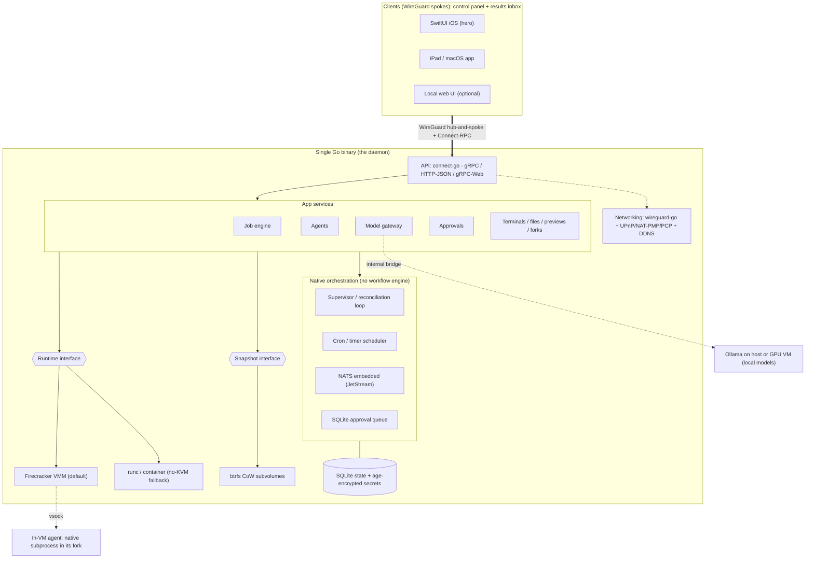
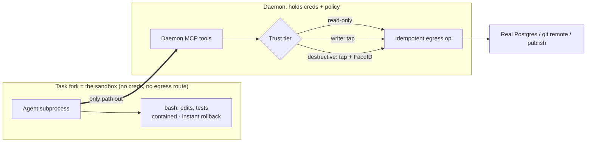
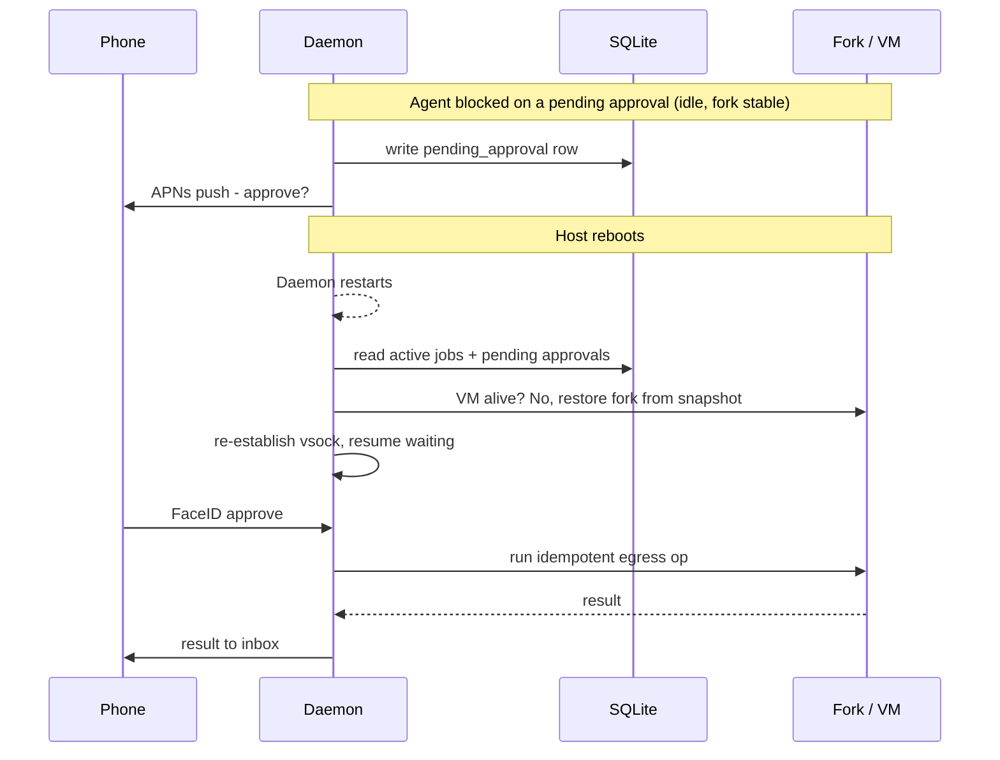

# Fletcher - Design Doc

*Self-hosted agent compute.*

Private agent compute on hardware you own. A single Go binary you install on one
Linux box; from a native phone/desktop client you spin up isolated VMs and run
anything on them - coding agents, day-to-day jobs, recurring monitoring - with
nothing leaving your network and no cloud account anywhere in the loop.

---

## 1. Positioning

- **Wedge:** private agent compute on metal you own. The r/homelab / r/LocalLLaMA
  crowd who already run Ollama and won't send their code to a hosted agent.
- **Moat:** a *structural fact*, not a feature. Competitors host the compute as
  their business, so none of them can offer "runs on hardware you own" without
  abandoning their model. They can copy any feature in this doc; they cannot copy
  where it runs.
- **The climb:** "just a computer" is a bare substrate - too
  unopinionated to pull people in. The product puts an *opinionated, delightful
  agent experience* on top of that substrate. Privacy/own-your-metal is the
  **positioning** (and the moat); the native-app agent experience is the **demo**
  (what creates desire). We headline one, not both.
- **Scope of use:** coding tasks and general day-to-day jobs are co-equal
  priorities for the product itself. "Pick one hero" applies only to the
  launch/marketing hook, decided later - not to capability or personal use.
- **Business model:** one-time license. No SaaS, no hosted infrastructure, no
  metering. The developer hosts nothing.

---

## 2. Goals & Non-Goals

**Goals**
- Single static binary, `curl | sh` install, runs as a systemd service on one
  Linux box.
- Spin up arbitrary VMs from a native client, configured by image or tooling/deps.
- Run agents / jobs / programs safely in isolated, forkable VMs.
- Supervise unattended agents from a phone, including approval of destructive
  actions that survives a host reboot.
- Bring-your-own agent (Codex, Claude Code, local-model agents) with zero config
  hassle.
- Use local models; tokens and code never leave the user's network.
- Seamless networking out of the box, with zero infrastructure the developer
  hosts.

**Non-Goals (for now)**
- **macOS support is deferred** (see §10). Linux only for v-now.
- No multi-box mesh. Single box only; multiple *client devices* are fine.
- No hosted control plane / coordination SaaS.
- No built-in metering or billing.
- No skill marketplace (deliberate - see §8).
- Cross-site VM-to-VM networking is explicitly out of scope.

---

## 3. Architecture

> *VMM binary bundled via `embed.FS`, extracted on first run. One VMM process
> per VM at runtime - single binary to ship, not single process.*

**Two networking planes that never touch.** Clients talk only to the daemon (one
WireGuard peer, one allowed-IP). VM networking lives entirely inside the box.
Even preview URLs are the daemon reverse-proxying into a VM, so clients never need
a route into VM-land.

**No workflow engine in core.** An earlier design embedded Temporal as the
substrate. It's been cut: the agent is a black box running its own loop, so a
workflow engine can't checkpoint inside it, and embedding one contradicts the
"just a computer, let native primitives orchestrate" thesis. The properties
Temporal was standing in for are delivered by native primitives (supervisor loop,
SQLite, cron, idempotent egress). Temporal may return *inside* a future
first-party pipeline feature - never as the substrate. (See §6, §10.)

---

## 4. The Job Model (the one primitive)

Every use case - coding, monitoring, automation - is one abstraction wearing
different hats. Do **not** build long-running / cron / ephemeral as three
subsystems; they are three values of one field.

A **job** = **environment** + **payload** + **trigger** + **output sink**.

- **environment:** a VM, or (default for agent runs) a fork of one.
- **payload:** an agent (Claude Code, Codex, local-model agent) *or* a plain
  program the agent previously wrote.
- **trigger:**
  - `ephemeral` - fire once, run to completion, optionally tear down
    ("build me the dog-walking site").
  - `cron` - fire on a schedule ("fetch the odds every morning").
  - `long-running` - no terminating trigger; stays alive (a web app, a bot).
- **output sink:** where the result lands - a preview URL, a results card /
  dashboard in the client inbox, a file, a notification.

**Recurring jobs: two modes.** Most recurring "agent" tasks shouldn't run an agent
each time. The agent's job is to *write the scraper once*; after that a plain
cron'd program runs it - free, deterministic, reliable.
- **agent-authored-then-automated** (default for data fetching) - cheap, no tokens
  per run, no nondeterminism.
- **agent-in-the-loop** - only when each run needs *judgment*
  ("tell me what's interesting today," not just "fetch it").

---

## 5. Agent Execution & the Trust Boundary

This is the load-bearing correction over the original design. **Agent actions are
not orchestrated tasks.** The agent runs natively as a subprocess inside its fork
and does its own bash, edits, and tests with zero daemon mediation.

> *Gate by capability, not intent: the fork can freely **want** to touch the real
> DB, but can't **reach** it without going through the daemon.*

- **The fork is the sandbox.** Every action is contained by the CoW fork; blast
  radius is the fork; rollback is instant. In-fork bash needs a sandbox, not a
  gate - and it has one. So there's no "turn every tool call into a task" problem;
  it doesn't exist.
- **Durable state lives on disk, not in an engine.** Resume state = the agent's
  own persisted session/history inside the fork + the fork snapshot. The daemon's
  job is only to *decide* to resume; "resume" = restart the agent process pointed
  at its on-disk session on the restored snapshot. The concrete plan for realising
  this as interactive, persistent sessions is sketched in `docs/ROADMAP.md`
  Milestone 6.
- **Side effects that *escape* the fork are the real gates.** Writing the real
  Postgres, pushing to the real remote, promoting a fork to "real" - a small,
  enumerable set. Gate by **capability, not by intercepting intent:** the fork has
  no real credentials and no egress route, so the only way out is to ask the
  daemon. That chokepoint is where the approval sits. The agent may freely *want*
  to run the migration; it simply cannot *reach* the real DB without the daemon,
  which holds the age-encrypted creds and serves privileged ops as **MCP tools**.
  An egress proxy / shimmed `git`/`psql` is belt-and-suspenders for anything
  trying to route around MCP.
- **Idempotent egress.** Privileged ops carry idempotency keys; a retry after a
  crash must not double-apply.

**Credential modes (homelab reality).** The "no creds in the fork" property
above holds strictly only in **API-key mode**, where the daemon stamps headers
on outbound model calls via the gateway (§6). Most of Fletcher's audience runs
on subscription-based agent CLIs - Claude Max, ChatGPT Plus/Pro, Gemini
Advanced - which authenticate via OAuth tokens on disk (`~/.claude/`,
`~/.codex/`, etc.), not via headers the daemon can intercept. For those users
Fletcher exposes a **trusted-credential mode** per job: the named credential
directory is bind-mounted into the fork. In this mode the boundary is
explicitly weakened - in-fork code can read the OAuth tokens - but the §5 claim
still holds for every *non-mounted* credential (other integrations, other
secrets). On a homelab the operator and the agent's principal are the same
person, so "the agent can read my own subscription token" is an acceptable
threat-model concession. A daemon-side OAuth proxy per vendor would restore
strict isolation for subscription users; it is deferred past v0.1.0 because
each vendor's OAuth flow is an internal protocol subject to silent change.

**Crash-resume semantics (state plainly).** Resume is "from the agent's last
persisted turn," *not* a frame-perfect mid-instruction restore. If the box dies
between an agent disk-write and the next snapshot, restored state is seconds behind
and the agent re-derives from there (hence idempotent egress). The
**approval-gate-survives-reboot** case is the clean one: while blocked on a pending
approval the agent is idle, the fork isn't mutating, the snapshot is stable, so
nothing is lost.

**How the properties Temporal used to provide are delivered now:**

| Property | Native implementation |
|----------|----------------------|
| Resume after crash | Supervisor goroutine reads active jobs from SQLite on boot, restarts those agent processes against their on-disk sessions. A reconciliation loop (the containerd/k8s pattern). |
| Approval that survives reboot | `pending_approval` row in SQLite + APNs push; the privileged call blocks until the row resolves. Survives reboot because the row does. |
| Idempotent retries | Idempotency keys on egress ops (needed regardless of any engine). |
| Scheduled jobs | Cron library / systemd timers firing a daemon RPC. |
| VM lifecycle | Direct daemon operations + startup reconciliation. |

---

## 6. The Model Gateway

The daemon **is** the model gateway - the key call for "any agent, no hassle."

- Every agent (Codex, Claude Code, local-model agent) points its base-URL at the
  daemon's local endpoint. The daemon routes to Anthropic / OpenAI / local Ollama
  and holds all credentials.
- Configure a provider **once, centrally**; any agent in any VM inherits it.
- Swap local-vs-cloud **per job** without touching agent config.
- **Keys never enter the fork** (API-key mode) - this *is* the privacy story for
  credentials the gateway can stamp on the wire, and it's what makes the
  capability boundary in §5 hold. See §5 "Credential modes" for the
  subscription-mode caveat.
- Every model call flows through one place → free audit log.

*Verify per agent:* that it actually honors a base-URL override (Claude Code,
Codex, and OpenAI-compatible tools generally do; a few are stubborn).

---

## 7. Clients - Control Panel + Results Inbox

The native first-party client is the product to a non-technical user, and it has
**two surfaces**, both first-class:

- **Control panel:** VMs, terminals, live previews, the approval prompts.
- **Results inbox:** a feed of cards / small dashboards where job outputs land
  ("today's flight prices," "disk usage report," "build finished - preview").

The inbox is half of why monitoring use-cases are sticky and is probably what makes
non-technical people open the app daily - you check a dashboard, you don't check a
terminal. Design for both from the start.

---

## 8. What Separates Us

**The moat is structural:** this runs on metal the user owns. The two relevant
camps both structurally can't follow:

*Hosted compute clouds* - they host the compute as their business:
- **OpenComputer / E2B** - cloud API sandboxes; key-based, metered, you ship code
  *to* them. We never meter and nothing leaves the LAN. (OpenComputer is the
  closest primitive match and open source - study it; its hosted model is the
  difference.)
- **Pi.dev** - secure terminal coding agent pitching "code never leaves your
  boundary," with regulated-industry pull. Validates our wedge has commercial
  weight; it lives in a CLI, not a native client.

*Self-hosted agent incumbents* - same "runs on your server" turf, huge mindshare,
but a different shape:
- **Hermes** (Nous Research, ~175k★) - self-hosted autonomous agent with persistent
  memory, self-writing skills, scheduled tasks; reached through *other people's*
  chat apps (Telegram/Discord/etc.). Sandbox is just Docker.
- **OpenClaw** (MIT, ~365k★) - widest chat surface + Chrome control + a skill
  marketplace (ClawHub) that suffered waves of malicious skills.

**Our two differentiators against the agent incumbents:**
1. **A real native first-party client**, not a chat-app bot. They pipe through
   Telegram/Discord because they have no client of their own; a beautiful iOS/Mac
   app is the hardest thing for a bot-shaped competitor to copy.
2. **Real per-task sandboxed microVMs with instant fork/rollback** as the unit of
   work. Hermes-in-Docker can't fork-and-roll-back an environment the way we can.

**Steal selectively (on-wedge only):** persistent memory + scheduled jobs (Hermes);
browser control as an accessible "go do this on the web" feature (OpenClaw). **Skip
the self-writing-skills me-too. Skip the skill marketplace entirely** - it's an
attack surface that directly contradicts a trust-positioned product.

---

## 9. Stack Reference

| Concern | Choice | Notes |
|---------|--------|-------|
| Language | Go | Single static binary; `CGO_ENABLED=0` (Linux). |
| API | `connectrpc.com/connect-go` | One handler → gRPC (SwiftUI), HTTP/JSON (CLI), gRPC-Web (web). |
| Runtime (default) | Firecracker + `firecracker-go-sdk` | KVM microVM; own kernel; right isolation for LLM-authored code. |
| Runtime (fallback) | `runc` / containerd | Labeled degraded-isolation path for no-KVM (Pi, nested-virt-less Proxmox). |
| Runtime abstraction | Pluggable interface | Keeps Linux-only impl details below the seam; lets Cloud Hypervisor (and later macOS VZ) slot in for one driver's cost. |
| Image pipeline | self-built: `docker build` → flattened ext4 rootfs image | OCI image → rootfs at import time. Avoids a containerd daemon + devmapper thin-pool; see the §11 decision. |
| Fork/snapshot | btrfs subvolumes (runc) / reflinked ext4 images (Firecracker), behind a snapshot interface | Instant CoW clone of a 10GB env; space-shared. |
| Job engine | bespoke (job = env + payload + trigger + sink) | §4. One model; trigger has three values. |
| Resume / supervision | bespoke supervisor + reconciliation loop | §5. Reads active jobs from SQLite on boot, restarts agent processes. |
| Approvals | `pending_approval` rows in SQLite + APNs | §5. Survives reboot because the row persists. |
| Scheduling | cron library / systemd timers → daemon RPC | Fires scheduled jobs. |
| Model gateway | bespoke; daemon-local OpenAI/Anthropic-compatible endpoint | §6. Holds creds; routes to Anthropic/OpenAI/Ollama; keys never enter forks. |
| Events | `nats-io/nats-server/v2` (embedded) + JetStream | Terminal fan-out, agent events, results-to-inbox, push triggers. |
| Daemon ⇄ guest | vsock | Tiny in-guest agent listens; daemon dials in, streams stdout. |
| State | `modernc.org/sqlite` (pure Go) + `sqlc` + `golang-migrate` | No CGO; cross-compiles cleanly. Migrations embedded via `embed.FS`. |
| Codegen | `sqlc` + `buf` + `protoc-gen-connect-go` + `mockery` v3 (matryer template) | Single `make generate` drives all; generated code committed. |
| Validation | `bufbuild/protovalidate-go` | Rules in `.proto`; enforced via Connect interceptor - single source of truth with the schema. |
| IDs | `jetify-com/typeid-go` | Prefixed, type-safe IDs (e.g. `job_01h...`). |
| Secrets | `filippo.io/age` | Encryption at rest for tokens/keys. |
| Networking | `wireguard-go` + UPnP/NAT-PMP/PCP + DDNS | Hub-and-spoke; no DERP/ICE; STUN is optional one-shot. |
| Terminal | `creack/pty` + `coder/websocket` | PTYs in-VM; streamed to clients. |
| Agents | MCP server in daemon (`mark3labs/mcp-go`); spawn Claude Code / Codex / OpenHands / Aider / Goose | Agent-agnostic, native subprocess in the fork. Privileged ops exposed as MCP tools. |
| Auth | `go-webauthn/webauthn` (passkeys) + `lestrrat-go/jwx` | Device pairing. |
| TLS | `caddyserver/certmagic` | ACME for preview endpoints. |
| Observability | `log/slog` + optional OTLP + Prometheus `/metrics` | User points at their own Grafana/Tempo. |
| Config/lifecycle | `urfave/cli` v3 + `oklog/run` | CLI does flag/env/TOML-file config natively; oklog/run owns subsystem start/stop. Runtime-mutable settings live in a SQLite `settings` table. |
| Self-update | `minio/selfupdate` | Signed binary updates. |
| Build/dist | `goreleaser` | linux/amd64, arm64, arm. |

---

## 10. Platform: Linux Now, macOS Deferred

**Now: Linux only.** Bare-metal or nested-virt host with `/dev/kvm`; Firecracker
runtime; runc as the labeled no-KVM fallback; btrfs for forks; one static
`CGO_ENABLED=0` binary. Clean and uncompromised.

**Why Mac isn't free** (the assumption "Mac is unix so it's fine" is true at
userland and irrelevant here): Firecracker uses Linux KVM and the Firecracker team
doesn't plan macOS support. The portable axis isn't POSIX - it's the
virtualization/kernel-isolation primitives, which Linux and macOS share nothing on.

**The deferral is cheap *if* the seams stay honest.** Keep all KVM/Firecracker
calls behind the runtime interface and all btrfs calls behind the snapshot
interface. Do **not** scatter `exec("btrfs …")` or `/dev/kvm` checks through the
job/agent/gateway code. Linux-only in *implementation*, platform-agnostic at the
*interface seam* - you want that regardless.

**Mac dev today (a free win from the same seams).** Day-to-day development
happens on macOS. The pure-Go bulk of the daemon (`CGO_ENABLED=0`,
`modernc.org/sqlite`, `slog`, Connect handlers, NATS, MCP plumbing) compiles
and runs there unchanged. The Linux-only pieces sit behind the runtime and
snapshot interfaces, which ship with `MockDriver` implementations:
`runtime.MockDriver` spawns local processes instead of microVMs;
`snapshot.MockDriver` does directory copies instead of btrfs subvolumes. The
daemon's coordination logic - supervisors, approvals, the gateway, the job
state machine - is exercised end-to-end on Mac via the mock drivers. For real
Firecracker/btrfs/WireGuard work, cross-compile (`make build-linux-arm64`)
and run inside an arm64 Linux VM (UTM on M1). The mocks are not a test hack;
they are required production-code citizens behind the same interfaces the
macOS port will eventually plug a real driver into.

**When we revisit, the macOS path is:** Apple Virtualization.framework via
`Code-Hex/vz` (boots Linux guest VMs; supports virtio/vsock/Rosetta) as a third
runtime driver; APFS `clonefile` as a second snapshot backend; and a divergent Mac
build (CGO + `com.apple.security.virtualization` entitlement + code-signing +
notarization - not a static binary). Recommended path then: native VZ driver (works
on all Apple Silicon + Intel, no nested-virt requirement), not a nested-Firecracker
appliance (which needs M3+/macOS 15 and adds overhead).

---

## 11. Open Questions - Verify Before Building

Load-bearing and fast-moving; check the actual repos/tools before betting on them:

- **`firecracker-containerd` - RESOLVED (Milestone 5), not used.** We verified the
  trade and chose against it. It would require running a containerd daemon plus the
  firecracker shim as supervised services and provisioning a devmapper thin-pool -
  a second always-on process and a second storage-provisioning step, both of which
  cut against the single-static-binary thesis and the "no manual setup dance" goal.
  Its registry-pull / layer-caching features are ones we do not need (`fletcher
  image import` already covers our flow). Instead the image pipeline is self-built:
  flatten the OCI image to an ext4 rootfs once, then CoW-clone it per job behind the
  existing `snapshot.Driver` seam (reflink on btrfs), with VM lifecycle via
  `firecracker-go-sdk` directly. The seam means firecracker-containerd could still
  be added later as an *alternative* image/snapshot driver without a rewrite, so
  this is not a one-way door.
- **Firecracker snapshot/restore maturity** - underpins hibernate/wake. Note: live
  memory-snapshot restore is for *instant-wake UX only*; it is **not** load-bearing
  for durability correctness (that comes from restarting the agent against its
  on-disk session + a consistent fork snapshot + idempotent egress). Don't
  over-engineer the durability path chasing a RAM-restore guarantee you don't need.
- **Agent resume ergonomics** - confirm your chosen agent(s) can be restarted
  against a persisted session and pick up reasoning. *This capability, not any
  engine, is what in-fork durability actually rests on.*
- **Base-URL override per agent** - confirms the model-gateway design (§6).

---

## 12. Scope & Sequencing Notes

End-state is described above; scoping is the owner's call. Carried reminders:

- **The hardest remaining work is the runtime/image layer**, not networking.
  Networking is deliberately the boring, solved, hub-and-spoke case.
- **One primitive, many hats.** The job model (§4) unifies every use case - resist
  re-splitting it into three subsystems.
- **Keep the interface seams clean** (§10) so macOS is "one more driver," not a
  rewrite.
- **Discipline at launch.** The substrate is general on purpose, but the launch
  hook is not: pick one magical demo when you make the video. Privacy is the
  positioning; the native-app agent experience is the wow.

---

## 13. Build Sequencing (Phases)

Vertical-slice approach: build the thinnest end-to-end path through the
system with mock drivers, then iteratively swap in real implementations.
The §10 mock drivers are the structural enabler - they are required
production-code citizens, not test hacks.

Why vertical over horizontal: the structural risks here (resume semantics,
the trust boundary, idempotent egress, supervisor reconciliation) only
become real when there is something to test them against. Building "the
SQLite layer" then "the API layer" then "the runtime layer" risks
polishing infrastructure that turns out to be the wrong shape when
integration arrives.

| # | Phase | Outcome |
|---|-------|---------|
| 0 | Foundations | Makefile, deps, lint, lefthook, package skeleton, `fletcher version`. Build pipeline green. |
| 1 | Skeleton daemon | `fletcher serve` runs an `oklog/run` group; `Health` RPC over Unix socket; `fletcher health` calls it; SQLite opens and migrates. |
| 2 | Job model + storage | Migration + sqlc for `jobs`; CRUD RPCs; CLI `fletcher job create/get/list/cancel`. |
| 3 | Mock runtime + supervisor | `runtime.MockDriver`, `snapshot.MockDriver`, supervisor that picks queued jobs and runs them. Resume-on-boot. |
| 4 | Trust boundary plumbing | `internal/errs` + Connect interceptor; `background.Go` + `fname`; audit middleware seam (wrapper exists, no storage yet). |
| 5 | Model gateway (basic) | Daemon-local OpenAI-compatible endpoint, one backend (Anthropic), age secrets, base-URL injected. |
| 6 | MCP server | `mark3labs/mcp-go` in daemon; 1-2 trivial privileged tools; routed through audit seam. |
| 7 | Approvals | `pending_approvals` table + RPCs + CLI. (APNs push deferred.) |
| 8 | Real Linux runtime | Real Firecracker + runc + btrfs drivers behind same interfaces. Requires UTM dev VM. Mocks stay forever. |
| 9 | Networking | WireGuard peers + UPnP/NAT-PMP/PCP + DDNS. Large standalone chunk. |
| 10 | v0.1.0 polish | Install script, systemd unit, README quickstart, goreleaser config, first tagged release. |
| 11 | Base image (`fletcher-base`) | A Fletcher-blessed OCI image built from a Dockerfile in-repo (reference pattern: exe.dev's "exeuntu"). Variants named `fletcher-base:debian-13`, `fletcher-base:ubuntu-24.04`, etc. - descriptive, not portmanteau. Ships with: three agent CLIs pre-installed (`claude` from Anthropic, `codex` from OpenAI, `pi` from Earendil - `pi` is the recommended default for users without a strong agent preference, because its extensions system enables Phase 14's deeper integration, but all three are first-class so users can keep existing workflows); their config directories pre-created at the well-known paths Phase 12's bind-mounts target; a single `AGENTS.md` symlinked into each agent's expected location (one source of truth for shared instructions); a `fletcher` user (UID 1000, NOPASSWD sudo, linger enabled for systemd-user services); dev essentials (git, gh, jq, ripgrep, vim, build-essential, Node, Go, Python, uv); the daemon contract baked into env defaults (gateway base-URL, MCP URL, `/workspace` mount point) so agents don't need per-job env configuration; `wireguard-tools` - **not** Tailscale, which is off-thesis (hosted control plane); no baked SSH host keys (generated at VM creation); `x-systemd.growfs` in `/etc/fstab` for first-boot rootfs expansion. Built via standard `docker build`; flattened by the snapshot driver into a btrfs subvolume (runc) or an ext4 rootfs image (Firecracker) at `<snapshots>/images/<name>`, per the self-built image-pipeline decision in §11. Substrate for phases 12, 13, 14. |
| 12 | Trusted-credential mode | Per-job opt-in to bind-mount named credential directories (`~/.claude`, `~/.codex`, `~/.config/gemini`) into the fork. Enables subscription-auth agents (Claude Max, ChatGPT Plus, Gemini Advanced) - the primary audience - at the documented §5 "Credential modes" cost. |
| 13 | Anthropic-native gateway inbound | Gateway accepts `POST /v1/messages` directly; daemon injects `ANTHROPIC_BASE_URL` alongside `OPENAI_BASE_URL`. Closes the API-key path for Claude Code so users with an Anthropic console key can run it in a fork without §5 boundary breaks. Secondary to phase 12 by audience size but cheaper to ship. |
| 14 | Model catalog + per-agent integration | Gateway exposes a model-discovery endpoint (`GET /catalog.json` or equivalent) listing available providers and models - Anthropic, OpenAI passthrough, locally-served Ollama, etc. Surfaces through (a) a Fletcher CLI command (`fletcher models list`) for humans, and (b) a Fletcher-authored extension for `pi` (the Earendil agent baked into Phase 11) that pre-fetches the catalog and registers providers on startup - mirroring how exe.dev's `exe-dev` pi-extension does this for their gateway. Agents *without* an extensions system (Claude Code, Codex) continue to work via the env-var injection from Phase 13; no agent-side auto-discovery is possible for them and that is fine - Phase 12's trusted-credential mode is what those users actually need. The gateway becomes a model-discovery surface for humans and extension-capable agents, not a universal magic layer. |
| 15 | Zero-touch networking | Three in-thesis pieces that collapse the homelab operator's one-time setup to "start the daemon": (a) the daemon embeds `wireguard-go` + netlink so it brings the WireGuard interface up itself (no `wg-quick`, no `/etc/wireguard/fletcher.conf`); (b) UPnP auto-forwards the WireGuard UDP port at boot via the existing `portmap.Map`; (c) the UPnP response's external IP becomes the default `--public-endpoint` when the operator didn't supply one. Together: `sudo fletcher serve` on a normal home connection just works, including phone-from-cellular access. Falls back cleanly when UPnP isn't available (clear log, manual `--public-endpoint` required). Off-thesis users (behind CGNAT, symmetric NAT) point at the user-facing docs that explain bringing their own VPN (Tailscale, Headscale, ZeroTier, plain WG) - which still works because the daemon's listeners are network-agnostic. Requires `CAP_NET_ADMIN` on the daemon process (systemd unit grants it via Ambient). |
| 16 | `fletcher doctor` (diagnostic + action plan) | When Phase 15's automation doesn't "just work" (router refuses UPnP, host has multi-NIC routing, ISP put the connection behind CGNAT, daemon won't reach upstream providers), the operator should not have to read logs and guess. `fletcher doctor` runs a battery of checks (daemon health, `/dev/net/tun`, default-route count, public IP + CGNAT detection, UPnP probe, upstream provider reachability) and prints a prioritised action plan with concrete copy-pasteable commands. Most fixes are operator-side (router config, ISP, firewall) so the doctor diagnoses + explains rather than auto-fixing. All instructions are generic - no router brand names, no hard-coded IPs; commands print the operator's values at runtime. JSON output (`-o json`) for monitoring / CI; non-zero exit on any failure under `--quiet`. |

Past Phase 16 - don't plan now. Real users reshape priorities. Phases 11-16
above are concrete continuations derived from observed homelab / Claude Code
needs and the exeuntu reference, not speculation; anything past them should
wait for actual usage.

For live delivery status (what is actually built, what was cut and why, and the
phases proposed once usage surfaced them), see `docs/ROADMAP.md`. This table is
the plan of record; that file tracks state against it.
